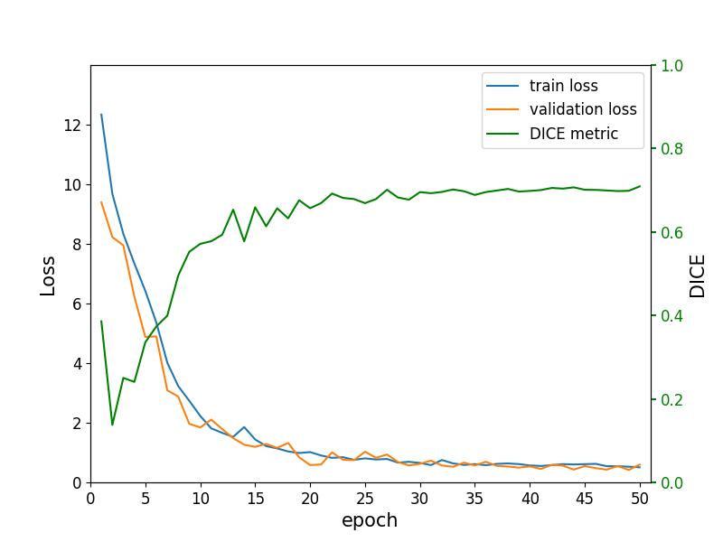

### HessNet

# **SegRunLib** #

This is simple library 

----------


## How to install ##
To install, you can use the command:

    pip install SegRunLib

Or download the repository from [GitHub](https://github.com/NotYourLady/SegRunLib)

----------

## Using Example ##
```
import SegRunLib

settings = {
    "in_path_nifty" : "/home/msst/PyProjects/TestLib/Images/IXI136-HH-1452-MRA.nii.gz",
    "out_path_nifty" : "/home/msst/PyProjects/TestLib/Segmentations/IXI136_seg.nii.gz",
    "device" : "cuda"
}

SegRunLib.run(settings)
```

msst project  
- easy to use for everyone
- no prerequirenments
  
----------


## From the developer ##

> Hello. Have a good day!
  
